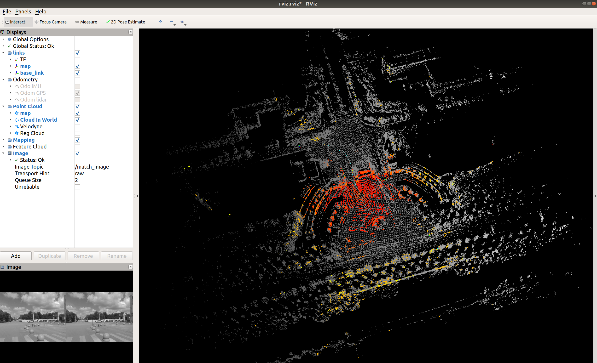

# LVI-SAM-LOCALIZATION
A simple version of system that can localize in a built map is developed in this repository. The sysytem is based on LVI-SAM, and also there are some features that we developed.  

- Through **Visual-LiDAR Fusion Relocalization**, the system can launch anywhere in the built map.
- Use the **C++ boost serialization**, the system can change the folder map to binary format, so that reduce map loading time by more than 30%.
  
A video of the demonstration of the method can be found on [YouTube]().

<p align='center'>
    
</p>

---

## Dependency
The dependency of this repo is same as the official [LVI-SAM](https://github.com/TixiaoShan/LVI-SAM). So if you occur a compile problem, we recommend you to compile the official LVI-SAM firstly. Right now we have only tested on Ubuntu 18.04 + ROS melodic environment.

## Compile
You can use the following commands to download and compile the package.
```
mkdir -p ~/catkin_ws/src
cd ~/catkin_ws/src
git clone https://github.com/x-Yabao/lvi_sam_localization
cd ..
catkin_make
```

## Prepare a built map
Take the M2DGR dataset for example.
1. Fisrtly, you need to **prepare a built map**. Please run our another work [lvi-sam-savemap](https://github.com/x-Yabao/lvi_sam_savemap) to build and save the map in a folder.
2. Change the above map to binary format, so that we can reduce the map load time.
   
   - Make sure the [config file](./config/m2dgr/params_function.yaml) is right.
  
   - Run the launch file:
    ```
    roslaunch lvi_sam_localization build_map_m2dgr.launch
    ```


## Run the package
Take the M2DGR dataset for example.
1. Make sure the [config file](./config/m2dgr/params_function.yaml) is right.

2. Run the launch file:
```
roslaunch lvi_sam_localization run_m2dgr.launch
```

3. Play existing bag files:
```
rosbag play your-bag.bag
```


## Notes
- **Initialization:** During the initialization stage, had better keep the robot still. Or if you play bags, fistly play the bag for about 0.5s, and then pause the bag until the initialization succeed. If initialization failure, move the robot to another play, or play the bag for a few seconds, than activate relocation again by give it random guesses on the the Rviz.

## Acknowledgement
- [LVI-SAM](https://github.com/TixiaoShan/LVI-SAM)
- [LVI-SAM-Easyused](https://github.com/Cc19245/LVI-SAM-Easyused)
- [LIO-SAM](https://github.com/TixiaoShan/LIO-SAM)
- [LIO-SAM_based_relocalization](https://github.com/Gaochao-hit/LIO-SAM_based_relocalization)
- [SC-LIO-SAM](https://github.com/gisbi-kim/SC-LIO-SAM)